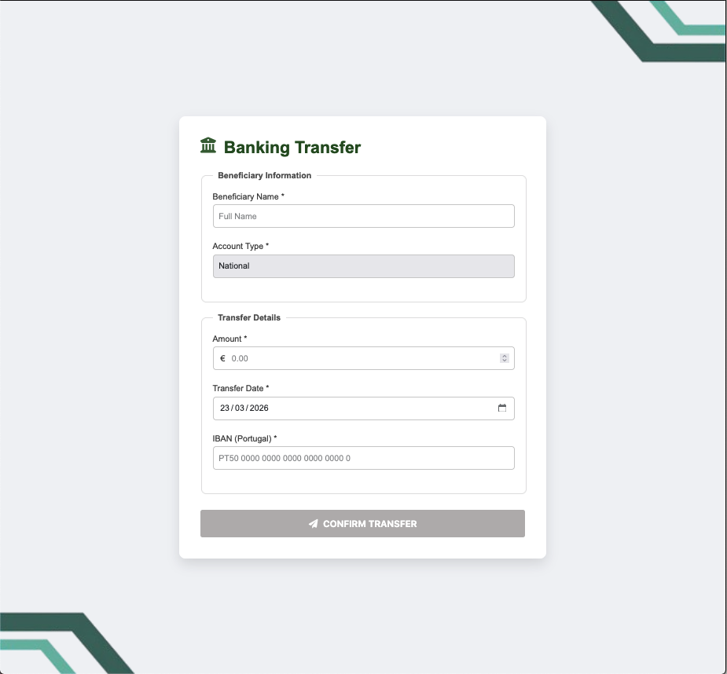
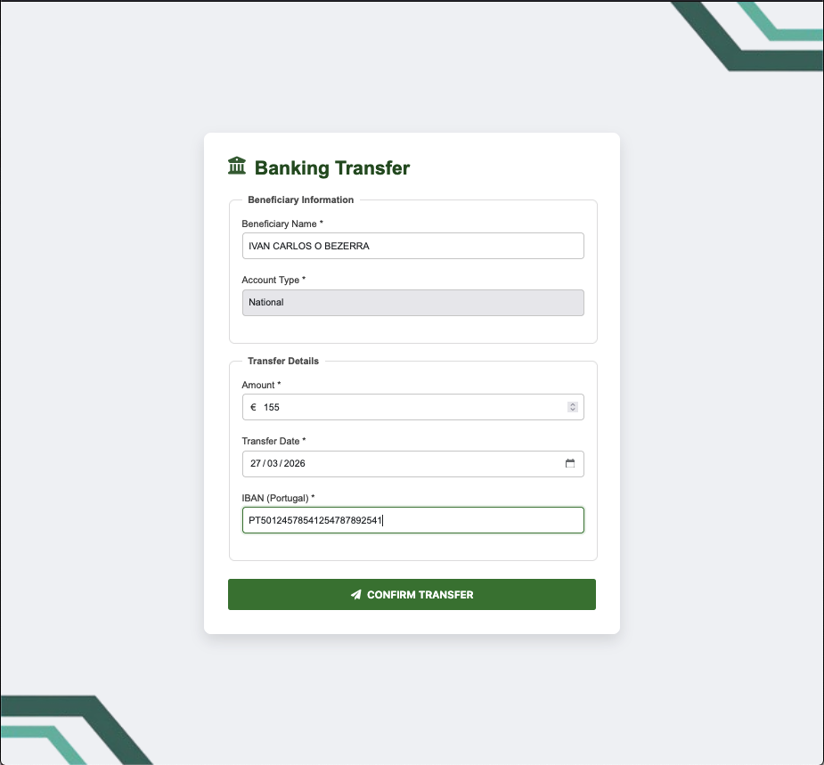
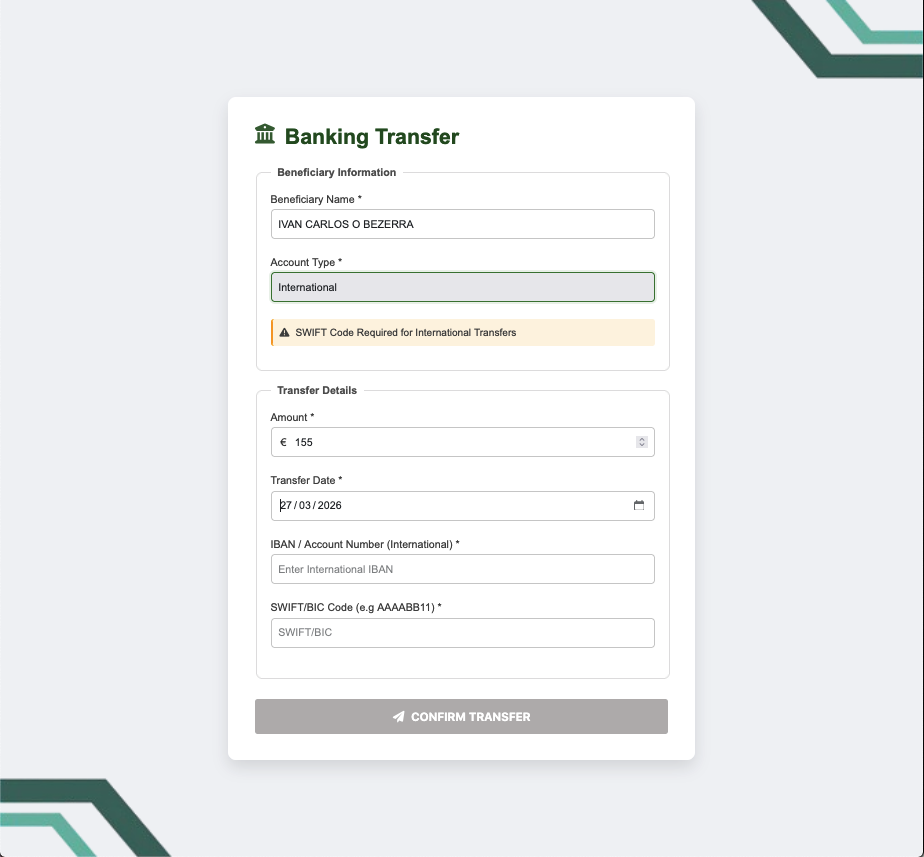
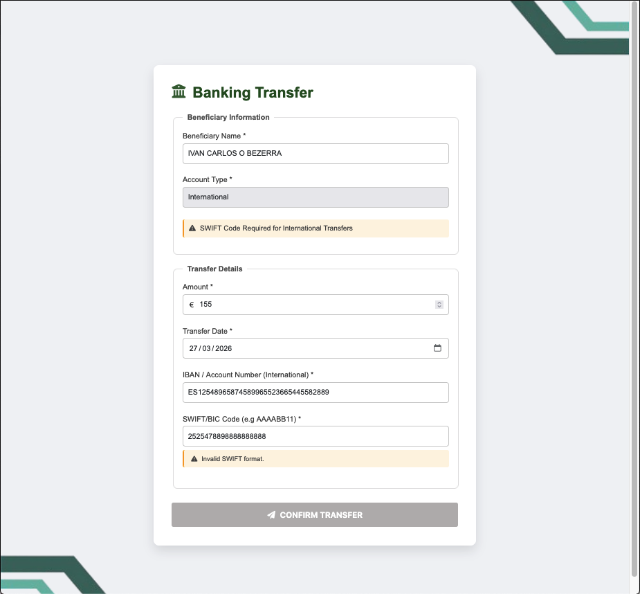
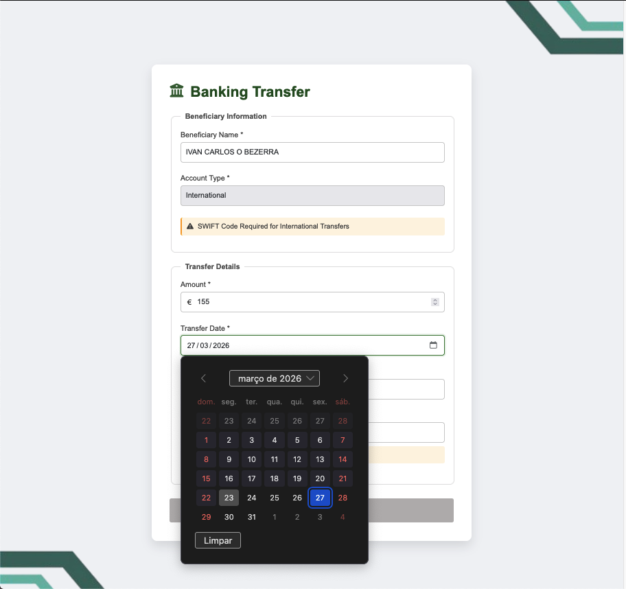
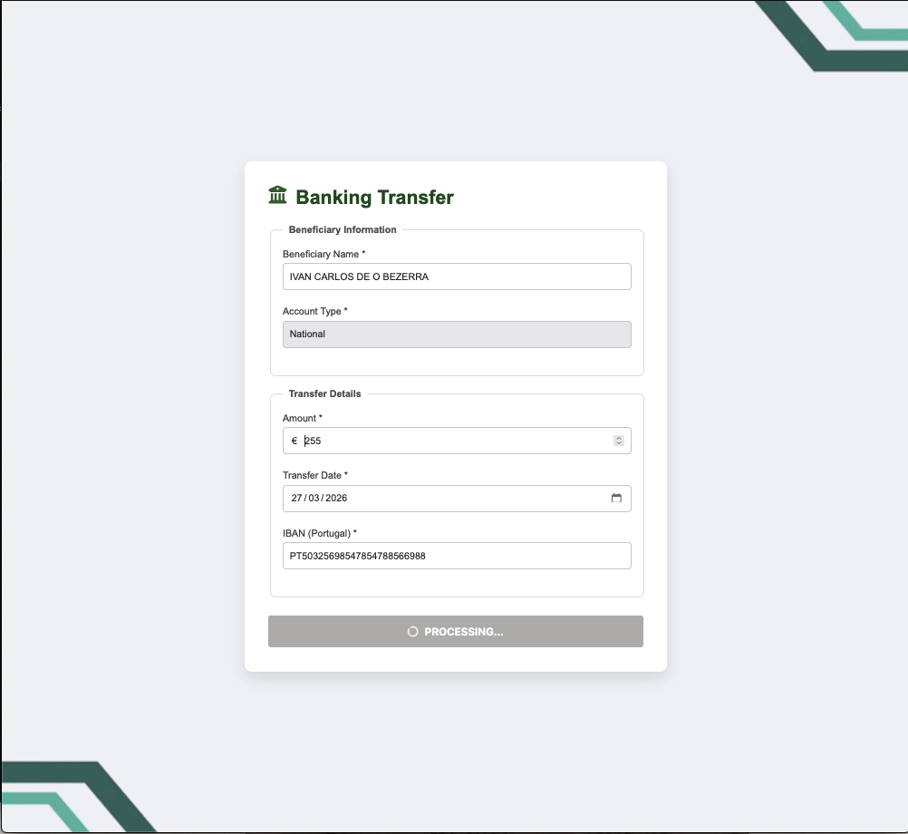
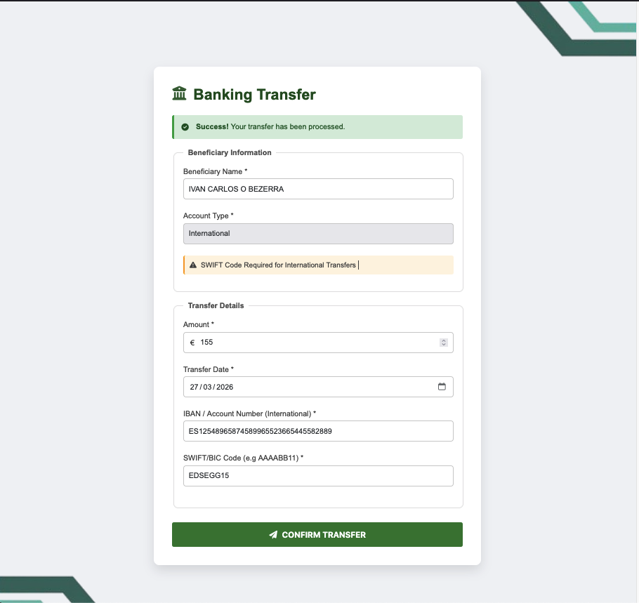

# 📊 Banking Transfer System - Angular

This project is a **ReactiveForm** module developed in **Angular 14**, focused on a seamless User Experience (UX) and strict data validation for both National (Portugal) and International operations.

## 🚀 Key Features

* **Dynamic IBAN Validation**: Automatically switches between National format (PT50 + 21 digits) and International formats (ISO 13616) based on user selection.
* **Smart SWIFT/BIC Management**: The field becomes mandatory only for international transfers, including real-time format validation.
* **UX-Focused Error Handling**: Error messages (e.g., "Invalid Format") only appear after the user leaves the field (`blur`), preventing annoying interruptions while typing.
* **Adaptive Interface**: Automatic field and state clearing when toggling between account types to prevent incorrect "hybrid" data submissions.
* **Submission Feedback**: Simulated processing state with a button spinner and automatic smooth scroll to the success message.
* **UI Normalization**: Custom CSS to ensure `input type="date"` and other native widgets match the project's typography and color palette.

## 🛠️ Technologies Used

* **Angular 14** (Reactive Forms & Custom Validators)
* **Bootstrap 5** & **FontAwesome** (Layout and Icons)
* **TypeScript** (Business logic and strict typing)
* **CSS3** (Custom animations and cross-browser styling)

## 📋 Prerequisites

Before you begin, ensure you have the following installed:
* [Node.js](https://nodejs.org/) (v14 or higher)
* [Angular CLI](https://angular.io/cli)

## 🔧 Installation and Execution

1.  **Clone the repository**:
    ``` bash
    git clone [https://github.com/ivanicob/banking-transfer-angular.git](https://github.com/ivanicob/banking-transfer-angular.git)
    ```

2.  **Install dependencies**:
    ``` bash
    npm install
    ```

3.  **Run the application**:
    ``` bash
    ng serve
    ```
    Access `http://localhost:4200/` in your browser.

## 🖼️ Screenshots

<p float="center">
  
  
  
</p>

<p float="center">
  
  
  
  
</p>

## 💡 Logic Breakdown

The system uses a custom `ibanValidator` that accesses the form's context to decide which Regex rule to apply:

```typescript
// Validation logic snippet
if (accountType === 'NATIONAL') {
  const ptRegex = /^PT50\d{21}$/; // Portuguese standard
  return ptRegex.test(value) ? null : { invalidIbanPT: true };
} else {
  const intRegex = /^[A-Z]{2}[0-9A-Z]{12,34}$/; // International standard
  return intRegex.test(value) ? null : { invalidIbanInt: true };
}